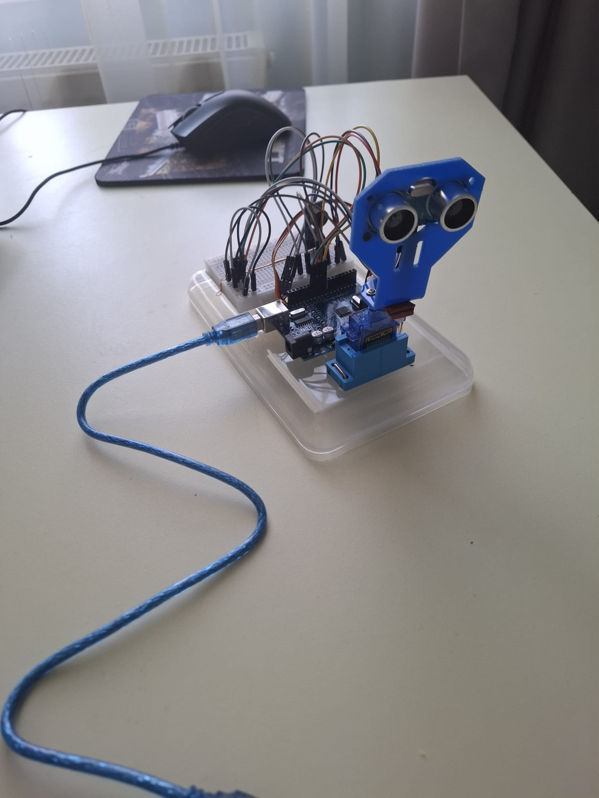
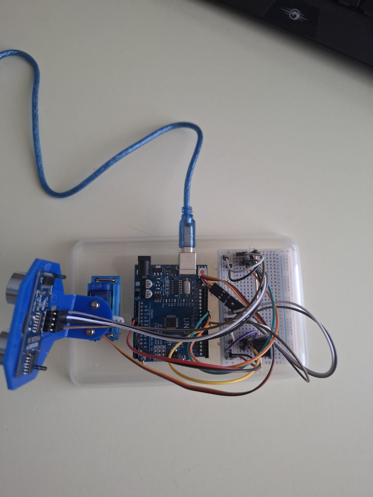
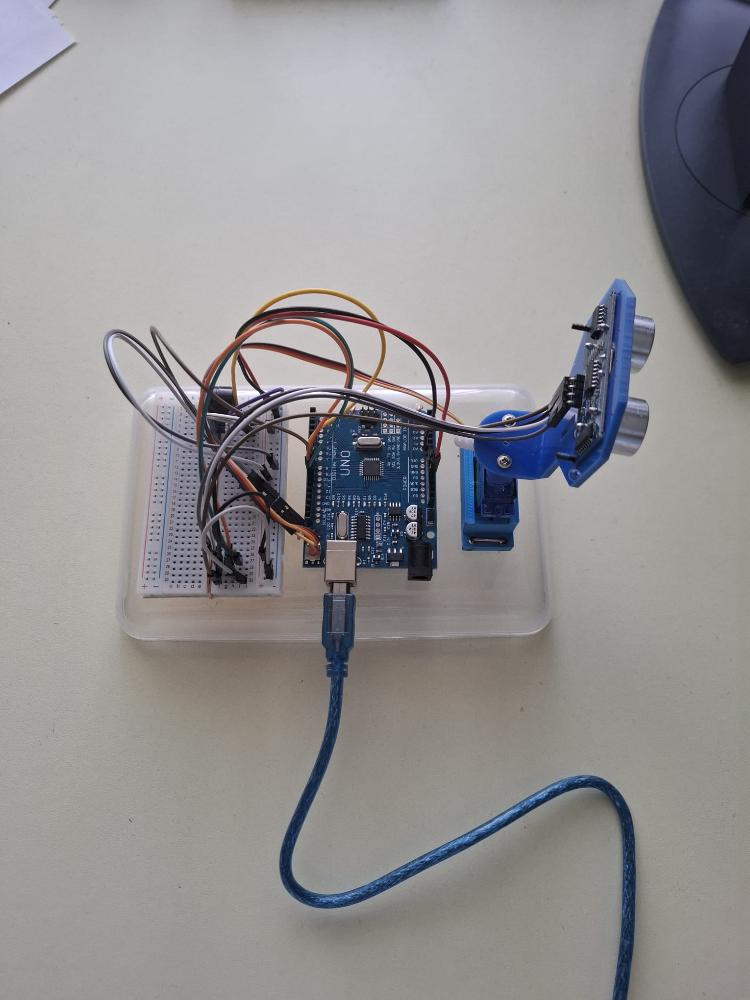
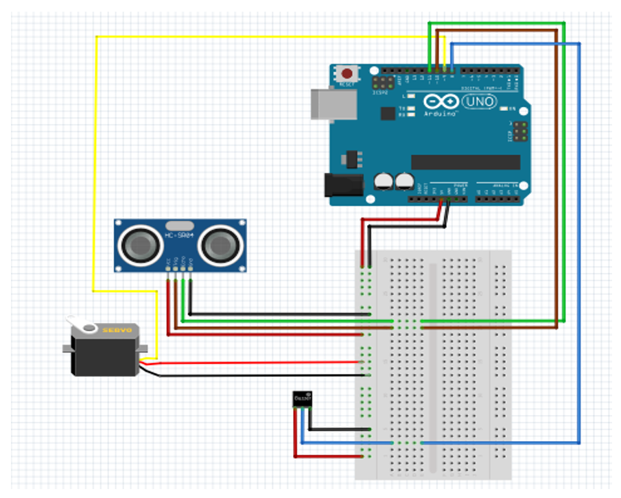

# Arduino Ultrasonic Radar

A radar system built with Arduino Uno, an HC-SR04 ultrasonic sensor, a servo motor, and a buzzer. The sensor sweeps 0°–180°, detects nearby objects, triggers an audio alert, and streams live data to a Python visualization over serial communication.

## Demo



## Features

- Servo motor sweeps the ultrasonic sensor from 0° to 180° continuously
- Detects objects within 40cm — stops the sweep and activates the buzzer when something is found
- Buzzer frequency increases as the object gets closer
- Streams angle + distance over Serial to a PC at 9600 baud
- Python script reads the serial data and renders a live polar radar display
- Smoothing filter applied to the distance readings to reduce visual flicker

## Hardware Components

- Arduino Uno
- HC-SR04 Ultrasonic Sensor
- Servo Motor
- Buzzer (YL-44)
- Breadboard and jumper wires

## Circuit Diagram



## Tech Stack

- **Firmware:** Arduino (C++)
- **Visualization:** Python 3, `pyserial`, `matplotlib`, `numpy`
- **Communication:** UART Serial at 9600 baud

## How It Works

1. The Arduino rotates the servo step by step, measuring distance at each angle
2. If an object is within range, the servo stops and the buzzer sounds — faster beeping means closer object
3. Each angle/distance pair is sent over Serial as `angle,distance`
4. The Python script reads this on a background thread and plots it as a live semicircular radar — a green line shows the current scan direction, a red dot marks the detected object

## Getting Started

### Arduino

1. Open `radar/radar.ino` in the Arduino IDE
2. Upload to your Arduino Uno
3. Connect hardware as shown in the circuit diagram

### Python

1. Install dependencies:
```bash
pip install pyserial matplotlib numpy
```
2. Set the correct port in `Radar.py`:
```python
PORT = "COM3"  # Windows — use "/dev/ttyUSB0" on Linux/Mac
```
3. Run:
```bash
python Radar.py
```

## Project Structure

```
radar/
    radar.ino        # Arduino firmware
Radar.py            # Python radar visualization
docs/
    hardware1.jpeg
    hardware2.jpeg
    hardware3.jpeg
    circuit.png
```

## Documentation

Full project documentation (in Romanian) is available in [`Documentation.pdf`](Documentation.pdf).
